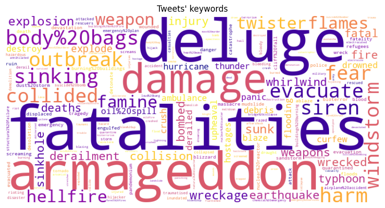
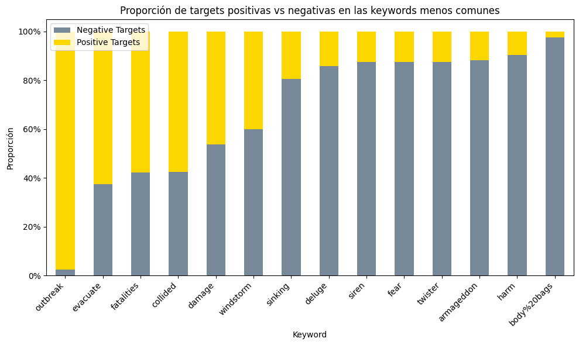
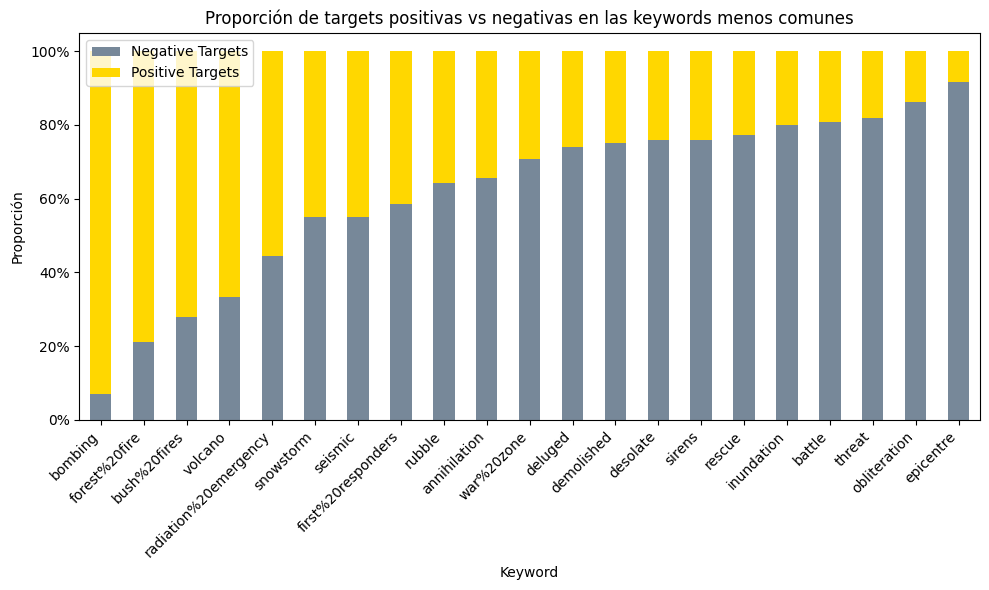
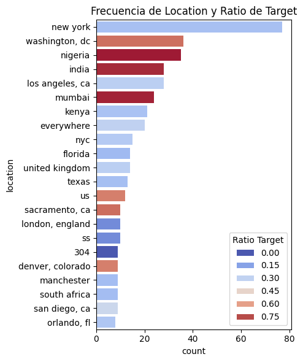
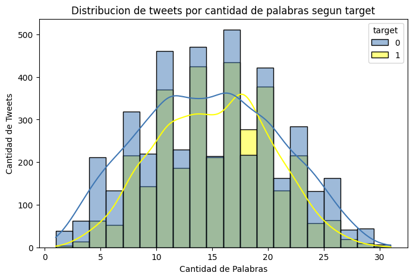
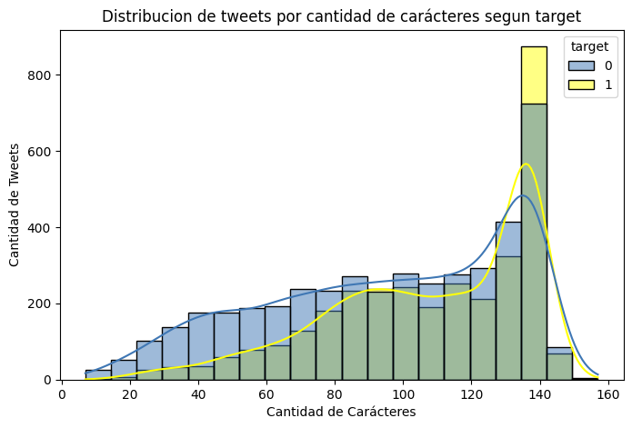
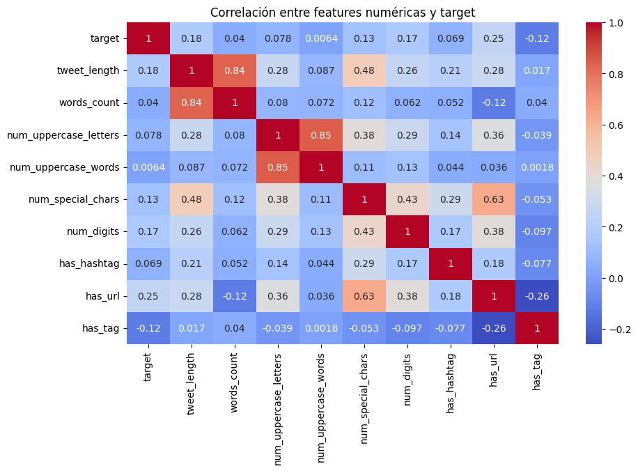
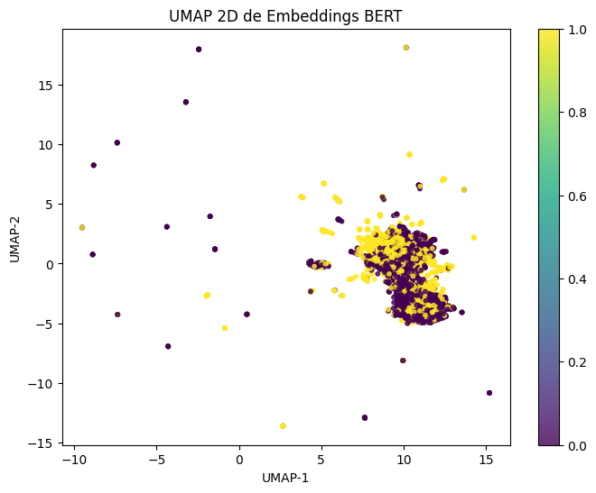
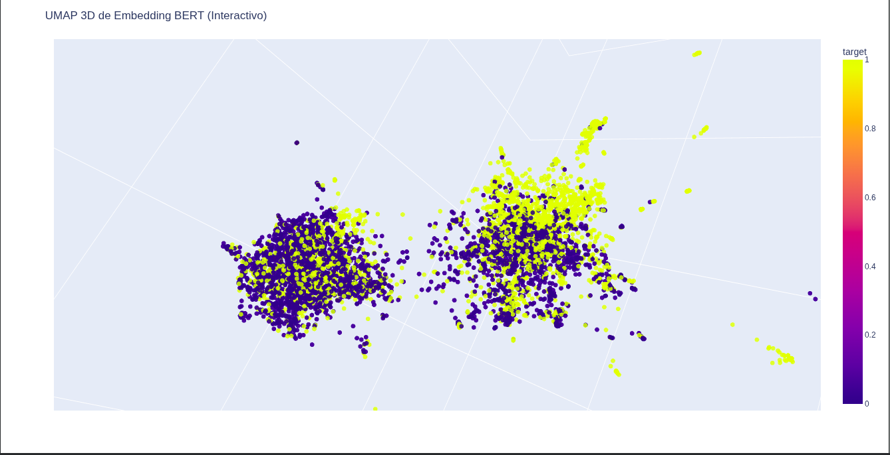

# Project Documentation

## Visualizations

In the first part of the project, I did EDA and plots using training data to avoid target leakage.

The starting features were `keyword`, `location` and `text`.

I started plotting a Word Cloud of the most common keywords.

This shows the main keywords in the dataset are words that can be disaster-related words. However, it's important to notice that some of them might not always be related to a disaster (e.g. fear, fire, damage).

From there, I plotted the most common and most uncommon keywords sorted by proportion of positive targets. This helps visualize how important might the keyword feature be.

In conclusion, the keyword is a key feature to predict the target, since there are keywords with proportions very far from 0.5.

For the locations, I did a Bar plot of location frequencies with target ratio hue (filtered to ≥8 occurrences and ratios ≤0.35 or ≥0.65). This identifies locations with informative target tendencies, suggesting location can contribute predictive signal after normalization. Aggregated stats per location (minimum 8 tweets) reveal several locations with target ratios far from 0.5 (thresholds ≤0.35 or ≥0.65), indicating potential predictive value even before advanced geocoding.

For the `text` of the tweet, I decided to extract the following text-derived features:

- Numeric features: `tweet_length`, `words_count`, `num_uppercase_letters`, `num_uppercase_words`, `num_special_chars`, `num_digits`.
- Categorical indicators: `has_hashtag`, `has_url`, `has_tag`.
- Language detection was tested but discarded due to unreliable results (tweets largely English/mixed content).

Histograms show similar distributions of `words_count` and `tweet_length` across targets, suggesting these alone are weak predictors. Shown below:

Lastly, I finished with some advanced visual checks:

Correlation heatmap (numeric features + target) assesses redundancy and weak-linear relationships.

No single numeric feature shows strong correlation with the target. However, features like `has_tag` and `has_url` had correlations with the target of 0.12 and 0.25 respectively, which denotes they are valuable.

Lastly, I rendered scatterplots and boxplots to explore interactions (e.g., `num_digits` vs. `tweet_length`; `has_url` vs. `num_digits` by target). These offered qualitative insight but no single feature cleanly separates classes.

## Baseline: Logistic Regression

All the models implemented were evaluated using the F1-score. The `train.csv` file was split into training and validation sets. `text.csv` was only used for submissions to the competition.

The LogisticRegression was trained as a baseline, only using the basic features extracted (tweet length, word counts and features related to special characters, digits, URLs or tags) and a TF-IDF text embedding (removing stopwords and using `nltk`'s `TweetTokenizer`). The results were:

- Best validation score: **0.747**
- Competition submission score: **0.78884**

## Feature Engineering

After establishing the baseline model with basic features, advanced feature engineering was performed to extract more sophisticated and informative features from the dataset. The training data was split into train and validation sets before feature extraction to prevent target leakage.

### Categorical Features

- **Keywords**:
  - Standardized to lowercase and stripped whitespace
  - 221 unique keywords identified
  - Encodings applied: One-Hot Encoding and Target Mean Encoding (model-dependent)

- **Location (standard_location)**:
  - Applied Hybrid NER (Named Entity Recognition) using spaCy to detect GPE/LOC entities
  - Used Nominatim geocoding to standardize location names and resolve synonyms
  - Manual mapping for common locations (e.g., "usa" → "United States of America", "nyc" → "New York")
  - Reduced unique locations from ~2,500 to 1,444 after normalization
  - Empty strings replaced with NaN to avoid misleading the model

- **Tweet Length**:
  - Converted from numeric to categorical feature based on quartiles
  - Four categories: `short` (≤Q1), `medium_short` (Q1-Q2), `medium_long` (Q2-Q3), `long` (>Q3)
  - Quartile boundaries: Q1=78, Q2=107, Q3=133 characters

### Geospatial Features

- **Latitude and Longitude**:
  - Extracted from standardized locations using Nominatim geocoding
  - Provides geospatial embedding with meaningful Euclidean distances between locations
  - Null values for tweets without valid location data
  - Corrected false coordinates (34.220389, 70.380031) that were incorrectly assigned to NaN locations

*Note: The usage of Nominatim wasn't done properly, I requested to the API once for each row instead of saving the results and applying them for each unique location. This lead to overloading the API which resulted in multiple timeouts that weren't resolved. Therefore some rows have null values when actual values can be extracted. This is left as a future improvement.*

### Numeric Features

Having new categorical features, the previous basic ones like `has_url` were replaced by numerical ones that could represent more information like `num_urls`.

- **Character-based counts**:
  - `num_uppercase_letters`: Count of uppercase letters
  - `num_uppercase_words`: Count of fully uppercase words (2+ chars)
  - `num_special_chars`: Count of non-alphanumeric characters
  - `num_digits`: Count of numeric digits

- **Tweet structure counts**:
  - `num_hashtags`: Count of hashtags (#)
  - `num_urls`: Count of URLs (http/https/www)
  - `num_tags`: Count of user mentions (@)

- **Proportional features**:
  - `prop_digits`: Ratio of digits to total characters
  - `prop_words`: Ratio of words to total characters

### Text Embeddings

- **TF-IDF (Initial approach)**:
  - Used `TweetTokenizer` from NLTK for tweet-specific tokenization
  - Removed English stopwords
  - Max features tuned as hyperparameter (tested range: 1000-4000)
  - Later discarded for advanced models due to high dimensionality and limited effectiveness

- **Word2Vec (Intermediate approach)**:
  - Trained on tokenized tweets
  - Vector size: 100 dimensions
  - Window size: 5, min_count: 2
  - Mean pooling of word vectors per tweet
  - Improved over TF-IDF but still suboptimal for the task

- **BERTweet (Final approach)**:
  - Pretrained bidirectional transformer model specifically for tweets
  - 768-dimensional embeddings from `[CLS]` token
  - Significantly improved model performance compared to TF-IDF and Word2Vec
  - Embeddings precomputed and persisted to CSV to avoid expensive recomputation

### Preprocessing Pipeline

- **ColumnTransformer** used to apply different transformations to feature groups:
  - StandardScaler for numeric features
  - OneHotEncoder for categorical features (with `handle_unknown='ignore'`)
  - Custom transformers for text embeddings
  - `remainder='passthrough'` for precomputed BERTweet features

### Dropped Features

- **Binary indicators** replaced by numeric counts:
  - `has_hashtag`, `has_url`, `has_tag` → replaced by `num_hashtags`, `num_urls`, `num_tags`

- **Redundant features**:
  - `location` → replaced by `standard_location`
  - `total_chars`, `words_count` → information captured by categorical `tweet_length`.

## Advanced Models and Results

XGBoost and RandomForest models were trained, aiming to obtain at least a 0.8 F1-score in validation. After that, the best model was used to predict `test` and submitted to the competition. The final results were:

- XGBoost best model's validation score: **0.8020**
- RandomForest best model's validation score: **0.7923**

However, the best XGBoost model was found after the task's deadline (the previous one had a worse score). For that reason, the RandomForest model was used for the submission. The result was:

- Final Submission score in test: **0.79528**

## Extras

### 1. KNN with Text Embedding (Revisited)

After the poor performance of the initial KNN model  (F1 ~0.60-0.62), which led to its discard in favor of XGBoost and RandomForest, a second attempt was made with significantly improved features:

**Motivation for retry:**

- BERTweet embedding (768 fixed dimensions) vs. TF-IDF (high dimensionality, sparse)
- BERTweet preserves semantic relationships through distances
- Added latitude/longitude features with direct geographical distance correlation
- Incorporated keyword statistical features (target mean encoding, appearance counts)

**Feature engineering for KNN:**

- Dropped `keyword` and `tweet_length` (redundant with keyword_feats and numeric counts)
- Created `standard_location` statistical features similar to keyword features:
  - `location_apariciones`: Count of location occurrences
  - `location_target_mean`: Smoothed target mean per location (k=5 smoothing factor)
  - `location_ratio`, `location_ratio_lower`, `location_ratio_upper`: Ratio metrics with 95% confidence intervals
- Handled null values intelligently:
  - Latitude/longitude: Filled with location-specific means, then global means
  - Other numeric features: Filled with global means
- StandardScaler applied to all numeric features

**Results:**

- **Best KNN validation F1: 0.735**
- Hyperparameters tuned: `n_neighbors`, `weights`, `p` (distance metric)
- Significant improvement over initial attempt (~0.60-0.62), demonstrating the importance of feature quality over model complexity.

### 2. UMAP Dimensionality Reduction and Visualization

**Objective:** Visualize BERTweet embeddings in 2D and 3D to assess if the embedding alone could predict the target.

**Methodology:**

- UMAP applied to 768-dimensional BERTweet embeddings
- Parameters: `n_components=2/3`, `n_neighbors=15`, `min_dist=0.1`, `metric='cosine'`, `random_state=123`
- Interactive 3D visualization created with Plotly Express

**2D Visualization:**

Shows overall distribution of tweets in reduced space, colored by target. Limited separation visible in 2D projection.

**3D Visualization:**

The 3D interactive exploration revealed more structure:

**Key observations:**

1. **Two main "clouds"** of data points with distinct characteristics:
   - **Dense cloud**: More compact, higher proportion of negative targets (blue, class 0). Targets are intermixed, making separation difficult.
   - **Sparse cloud**: More dispersed, higher proportion of positive targets (yellow, class 1). Some visible separation between classes.

2. **Outlier clusters**: Smaller, clearly differentiated groups scattered in the space, often separated by target class.

3. **Class distribution**: The two clouds have different target ratios, suggesting geographical or semantic regions in the embedding space correlate with disaster likelihood.

**Conclusion:**
The BERTweet embedding is **useful but insufficient** on its own for target prediction. While certain regions show clear target tendencies (e.g., dense cloud favors class 0, sparse cloud favors class 1), perfect linear separation is not achievable. This validates the need for additional engineered features (geospatial, keyword statistics, numeric counts) to improve model performance, as evidenced by the superior results of XGBoost and RandomForest models that combine embeddings with these features.
